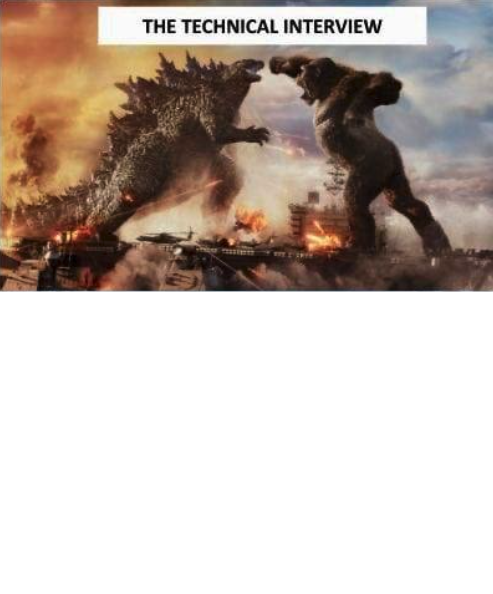
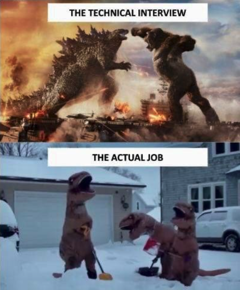

```{r setup, include=FALSE}
options(htmltools.dir.version = FALSE)
knitr::opts_chunk$set(
  fig.width = 9, fig.height = 3.5, fig.retina = 3,
  out.width = "100%",
  cache = FALSE,
  echo = TRUE,
  message = FALSE, 
  warning = FALSE,
  hiline = TRUE
)
```

```{r xaringanExtra-share-again, echo=FALSE}
# add share bar to slides
xaringanExtra::use_share_again()
```

```{r xaringan-themer, include = FALSE, warning = FALSE}
# load package
library(xaringanthemer)

# set accent theme
style_mono_accent(
  header_font_google = google_font("Nunito Sans"), # Sanchez
  text_font_google = google_font("Glacial Indifference", "300", "300i"),
  code_font_google = google_font("Fira Mono"),
  base_color = "#05859B",
  white_color = "#93C6C2", 
  background_color = "#FFFFFF",
  link_color = "#9b0546",
  text_bold_color = "#05859B",
  header_font_weight = 400,
  header_h1_font_size = "2.25rem",
  header_h2_font_size = "1.75rem",
  header_h3_font_size = "1.5rem",
  footnote_font_size = "0.7em",
)
```

class: inverse, middle

# `r fontawesome::fa("laptop-code", fill = "#93C6C2", a11y = "sem")` Demystifying the Technical Interview
<br>

<span style = 'font-size: 130%;'>Sam Csik | Data Training Coordinator</span>  

National Center for Ecological Analysis & Synthesis<br>

<br>

<span style = 'font-size: 130%;'>Master of Environmental Data Science | Spring 2021</span>   

Slides & source code available on [`r fontawesome::fa("github", fill = "#93C6C2", a11y = "sem")`](https://github.com/UCSB-MEDS/technical-interviews)

---
### `r fontawesome::fa("question", fill = "#05859B", a11y = "sem")` Technical interviews: what even are they?

<span style = 'font-size: 80%;'>`r fontawesome::fa("angle-right", fill = "#05859B", a11y = "sem")` They are a way for potential employers to assess a candidate's hard skills, knowledge of the field, and *how a candidate approaches technical problems/challenges*</span>

<span style = 'font-size: 80%;'>`r fontawesome::fa("angle-right", fill = "#05859B", a11y = "sem")` They can be coding-based (live, take-home, whiteboarding), presentations, or answering questions about tools, methodologies, approaches, etc. out loud</span>

<br>

.center[
```{r out.width = '50%', out.height = '50%', echo = FALSE}

```
]

.center[
<span style = 'font-size: 80%;'>Image source: [Technical interview resources](https://markodenic.com/resources-to-crush-the-technical-interview/) by Marko Denic</span>
]

---

### `r fontawesome::fa("flushed", fill = "#05859B", a11y = "sem")` Technical interviews can be intimidating

.center[
```{r out.width = '50%', out.height = '50%', echo = FALSE}

```
]

.center[
<span style = 'font-size: 80%;'>Source: This [tweet](https://twitter.com/catballar/status/1499036814044286977) by [@catballer](https://twitter.com/catballar)</span>
]

---
### `r fontawesome::fa("brain", fill = "#05859B", a11y = "sem")` But you likely know more than you think!

.center[
```{r out.width = '50%', out.height = '50%', echo = FALSE}

```
]

.center[
<span style = 'font-size: 80%;'>Source: This [tweet](https://twitter.com/catballar/status/1499036814044286977) by [@catballer](https://twitter.com/catballar)</span>
]

---
### `r fontawesome::fa("question", fill = "#05859B", a11y = "sem")` Technical interview questions/tasks can take *many* forms

<span style = 'font-size: 90%;'>Some very general examples:</span> 

<span style = 'font-size: 80%;'>`r fontawesome::fa("angle-right", fill = "#05859B", a11y = "sem")` Can you explain the difference between statistical test A and statistical test B?</span>

<span style = 'font-size: 80%;'>`r fontawesome::fa("angle-right", fill = "#05859B", a11y = "sem")` Given task X, explain your workflow and how you would collaborate with others.</span>

<span style = 'font-size: 80%;'>`r fontawesome::fa("angle-right", fill = "#05859B", a11y = "sem")` What is the package/tool Y used for?</span>

<span style = 'font-size: 80%;'>`r fontawesome::fa("angle-right", fill = "#05859B", a11y = "sem")` Here is a data set. Using your preferred programming language, please answer question X.</span>

<br>

--

<span style = 'font-size: 90%;'>The type, length, and difficulty of technical questions may vary with:</span> 

<span style = 'font-size: 80%;'>`r fontawesome::fa("angle-right", fill = "#05859B", a11y = "sem")` job classification (e.g. junior vs. senior-level data scientist)</span>   

<span style = 'font-size: 80%;'>`r fontawesome::fa("angle-right", fill = "#05859B", a11y = "sem")` sector (e.g. academia vs. industry)</span>  

<span style = 'font-size: 80%;'>`r fontawesome::fa("angle-right", fill = "#05859B", a11y = "sem")` stage of the interview process (e.g. you may have an entire interview stage dedicated to showcasing your technical skills via a coding/analytical challenge)</span>

---
### `r fontawesome::fa("book-reader", fill = "#05859B", a11y = "sem")` There are ways to prepare:

<span style = 'font-size: 80%;'>`r fontawesome::fa("angle-right", fill = "#05859B", a11y = "sem")` Research the role (e.g. analyze the job posting and organization's website)</span>

* <span style = 'font-size: 70%;'>identify what type of data science work/analyses you might be embarking on should you land/accept the job</span>
* <span style = 'font-size: 70%;'>review the types of tools, methodologies, and approaches you might use to address the work/problems outlined in the employer's materials</span>
* <span style = 'font-size: 70%;'>identify any areas you may not have direct experience in -- have an understanding of the landscape of tools available for working in that space and be able to reference a few (but be honest about your experience)</span>

--

<span style = 'font-size: 80%;'>`r fontawesome::fa("angle-right", fill = "#05859B", a11y = "sem")` Be able to talk about your project(s)</span>

* <span style = 'font-size: 70%;'>Some technical questions or tasks are more open-ended (e.g. see Example 1 on [slide 12](https://ucsb-meds.github.io/technical-interviews/#7)). Be prepared to talk clearly and succinctly about your goals and contributions to a project.</span>

--

<span style = 'font-size: 80%;'>`r fontawesome::fa("angle-right", fill = "#05859B", a11y = "sem")` Practice coding challenges -- there are a number of online resources/platforms including:</span>

* <span style = 'font-size: 70%;'>[Kaggle competitions](https://www.kaggle.com/competitions), which are designed to provide challenges for competitors at all different stages of their machine learning careers.</span> 
* <span style = 'font-size: 70%;'>[stratascratch](https://www.stratascratch.com/), a data science platform with >1000 real interview questions (new questions added each month)</span>
* <span style = 'font-size: 70%;'>[Confetti AI](https://www.confetti.ai/), a question bank covering core ideas in statistics, data science, and full-stack machine learning (new questions added each week)</span>
* <span style = 'font-size: 70%;'>[LeetCode](https://leetcode.com/), a platform for enhancing your skills, expanding your knowledge and preparing for technical interviews (primarily geared towards software developers, rather than data scientists)</span>

---
class: inverse, middle, center

### `r fontawesome::fa("ship", fill = "#93C6C2", a11y = "sem")` Example 1: Fisheries Data Scientist and Coordinator @ Environmental Market Solutions Lab (emLab), UC Santa Barbara

This technical component was provided to interviewees at interview round 2 (of 3). Check out the take-home task and associated job description [here](https://docs.google.com/document/d/1YxnLkj-IAD7ht4F8B91ExkjSsLnijFiW7dWgWx-UWbg/edit?usp=sharing).

---
class: inverse, middle, center

### `r fontawesome::fa("fish", fill = "#93C6C2", a11y = "sem")` Example 2: Data Scientist (exact title unknown) @ Global Fishing Watch

Candidates were given a choice of two different take-home challenges. Check them both out [here](https://docs.google.com/document/d/1OuewBioyncbnchWqLu-r-mGAJmj6uPPk7zTYO95cypU/edit?usp=sharing).

---
class: inverse, middle, center

### `r fontawesome::fa("tree", fill = "#93C6C2", a11y = "sem")` Example 3: Data Specialist @ Bureau of Land Management

Candidates are asked a series of interview questions, some of which required discussion about experience using particular data science tools and methodologies. Find all the interview questions [here](https://docs.google.com/document/d/1uX3Jg8iDtmceKCslmjk9nMrhhL4jRbYE-fKfdcwxCiQ/edit?usp=sharing).

---
class: inverse, middle, center

### `r fontawesome::fa("database", fill = "#93C6C2", a11y = "sem")` Example 4: Database Specialist @ Cary Institute of Ecosystem Studies

Candidates were given 48 hours to complete [this technical exercise](https://docs.google.com/document/d/1XMMUwnq5DblgbqLlh6C9_kPMVeLnqNGNz_Wk4RrGPps/edit?usp=sharing).

---
### Some closing thoughts:

<span style = 'font-size: 80%;'>`r fontawesome::fa("angle-right", fill = "#05859B", a11y = "sem")` Remember that many technical interview questions may not even have a correct answer -- interviewers want to see you reason and create solutions. Help them understand your thought processes by breaking down complex questions and talking out loud.</span>

--

<span style = 'font-size: 80%;'>`r fontawesome::fa("angle-right", fill = "#05859B", a11y = "sem")` Save your job postings (as pdfs, not just the URL) and any associated technical questions/challenges you may get during the interview process -- this not only helps you ensure that you highlight the skills they want see in a candidate but also allows you to review/practice past problems</span>

--

<span style = 'font-size: 80%;'>`r fontawesome::fa("angle-right", fill = "#05859B", a11y = "sem")` You can learn a lot from the experiences of others (i.e. talk with one another!)</span>

--

<span style = 'font-size: 80%;'>`r fontawesome::fa("angle-right", fill = "#05859B", a11y = "sem")` Technical questions are often just one part of the overall interview process -- don't ignore the other interview skills you've learned!</span>

---
class: center, middle

## Now go crush those interviews!
```{r echo = FALSE, out.width = '50%'}
knitr::include_graphics("media/michael_scott.gif")
```

Slides created via the R packages:

[**xaringan**](https://github.com/yihui/xaringan)<br>
[**gadenbuie/xaringanthemer**](https://github.com/gadenbuie/xaringanthemer)

<span style = 'font-size: 75%;'>*If you see mistakes or want to suggest changes, please create an [issue](https://github.com/UCSB-MEDS/technical-interviews/issues) on the source repository.*</span>

---
class: inverse, middle, center

## `r fontawesome::fa("brain", fill = "#93C6C2", a11y = "sem")` Practice questions

Find a partner and practice responding to these technical (albeit silly) questions.  

A primary goal is to gain confidence in talking through your thought processes out loud as you attempt to answer these questions. You should feel free to ask explicit, clarifying questions (like you might do in an interview).  

Pick one at random to keep things interesting :)

---
### Practice questions

<span style = 'font-size: 80%;'>The "interviewee" should try answering one of the following questions:</span>

<span style = 'font-size: 70%;'>**1.** How many tennis balls can you fit inside the NCEAS first floor classroom?</span>  
<span style = 'font-size: 70%;'>**2.** How long would it take for you to walk across the Santa Barbara Channel from Ventura Harbor to Scorpion Anchorage.</span>  
<span style = 'font-size: 70%;'>**3.** Explain, in detail, the process of making a cup of coffee.</span>  
<span style = 'font-size: 70%;'>**4.** How many licks does it take to get to the center of a Tootsie Pop?</span>  
<span style = 'font-size: 70%;'>**5.** You have 8 pennies and a scale. One penny weighs more than the others. Determine which penny weighs more in three or fewer steps. </span>  
<span style = 'font-size: 70%;'>**6.** Given a number 1 to 1000, what is the minimum number of guesses you would need to find that particular number if you are only given the hints "higher" or "lower" after each of your guesses.</span>  
<span style = 'font-size: 70%;'>**7.** How would you describe the taste of a cheeseburger (alternatively, substitute a different food here)?</span>  
<span style = 'font-size: 70%;'>**8.** How many keystrokes does it take to wear the letters off your keyboard?</span>  
<span style = 'font-size: 70%;'>**9.** Why don't whales have tails that are oriented in the same direction as those of sharks?</span>  
<span style = 'font-size: 70%;'>**10.** Why are doors rectangular instead of round or square?</span>

<span style = 'font-size: 80%;'>The "interviewer" should make note of the following:</span>

* <span style = 'font-size: 70%;'>Does the interviewee ask targeted follow-up questions?</span>
* <span style = 'font-size: 70%;'>How does the interviewee break down the question/problem?</span>
* <span style = 'font-size: 70%;'>Does the interviewee talk through his/her/their thought processes and reasoning *out loud*?</span>

